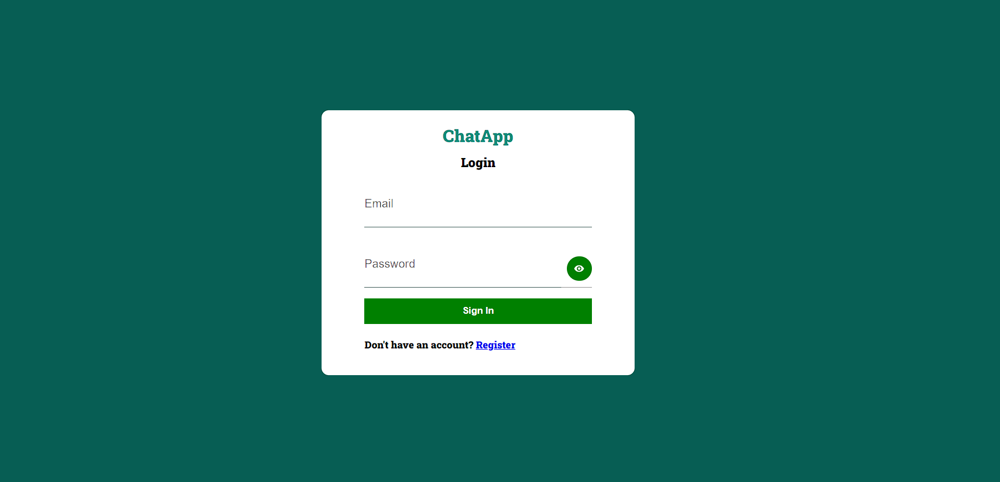
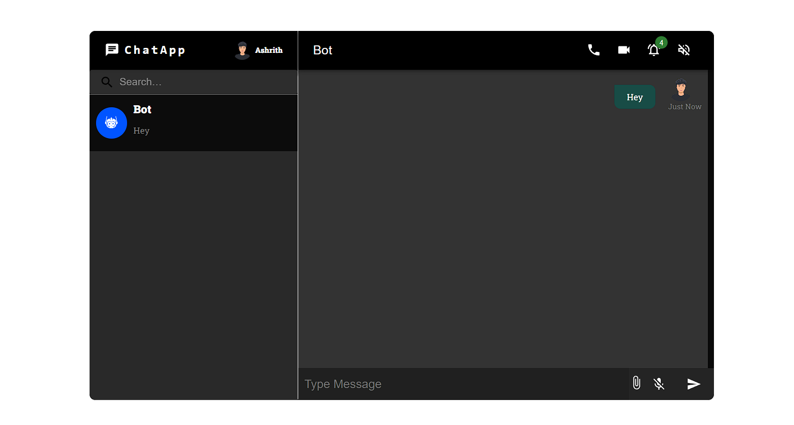

<h1>Chat App with Real-Time Messaging</h1>

This project is a chat application built using React, Material-UI, and Firebase. It features real-time messaging capabilities, user authentication for login and registration, and a sleek user interface using Material-UI components.

<h2>Features</h2>
<ul>
<li>Real-time messaging: Chat with other users in real-time.</li>
<li>User authentication: Secure login and registration using Firebase Authentication.</li>
<li>Material-UI components: Stylish and responsive UI design with Material-UI components.</li>
<li>Real-time messaging: Chat with other users in real-time.</li>
</ul>

<i>To test you can use the bot to chat with</i>

<h2>Screen Shots</h2>

<h2>Contributing</h2>

Contributions are welcome! If you find any bugs or have suggestions for improvements, feel free to create an issue or submit a pull request.
